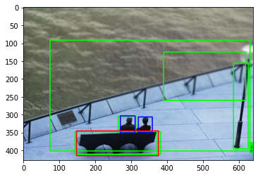

# 函数数据分析
分析如何用这个repository的eval的代码  # todo 分析train部分的代码

## 各数据文件分析

**instances_train2014.json**：单纯为coco提供object class和id

**annotations_test.json**: 这个box明确指出哪些是human，object和action_id

以im_id=1为例子：

    {'im_id': 1, 'filename': 'HICO_test2015_00000001.jpg', 'im_size': [640, 427, 3], 
    'action_id': 246, 
    'human_box': [270, 303, 311, 350], 
    'object_box': [148, 345, 376, 414]}
    
**bbox_hico_test_results.json**： 这个文件里是candidate box,还有每个box得分score

    {'bbox': [264.861145, 304.19696, 49.603271, 46.125916],
    'category_id': 1,
    'image_id': 1,
    'score': 0.994775}

把所有的数据画在一个图片当中就是下图
- 绿色代表: candidtae
  -      box:  [312.558167, 306.308105, 42.969666, 41.56781]  score:  0.98706
         box:  [264.861145, 304.19696, 49.603271, 46.125916]  score:  0.994775
         box:  [630.420654, 377.786835, 9.471436, 27.956543]  score:  0.228452
         box:  [633.460815, 379.248871, 6.539185, 17.817078]  score:  0.059481
         box:  [147.244598, 346.797272, 225.944031, 65.793152]  score:  0.807803
         box:  [74.157898, 92.55719, 558.060547, 309.970642]  score:  0.053679
         box:  [390.757843, 125.473976, 230.045624, 135.584282]  score:  0.097342
         box:  [585.362976, 156.22818, 42.355835, 240.154541]  score:  0.271536
         box:  [144.017548, 347.048798, 239.404175, 64.383362]  score:  0.093882
- 红色代表: object
     -     [array([147., 344., 375., 413.]), array([147., 344., 375., 413.])]
- 蓝色代表: human
     -     [array([319., 305., 358., 348.]), array([269., 302., 310., 349.])]
        

经过各种函数的sao操作 db_test.pkl得出：（我们的目的是如何利用这个代码,如何得出这个会费点儿脑子。。。）

    {'boxes': array([[147.      , 344.      , 375.      , 413.      ],
            [269.      , 302.      , 310.      , 349.      ],
            [319.      , 305.      , 358.      , 348.      ],
            [312.558167, 306.308105, 354.527833, 346.875915],
            [264.861145, 304.19696 , 313.464416, 349.322876],
            [630.420654, 377.786835, 638.89209 , 404.743378],
            [633.460815, 379.248871, 639.      , 396.065949],
            [147.244598, 346.797272, 372.188629, 411.590424],
            [ 74.157898,  92.55719 , 631.218445, 401.527832],
            [390.757843, 125.473976, 619.803467, 260.058258],
            [585.362976, 156.22818 , 626.718811, 395.382721],
            [144.017548, 347.048798, 382.421723, 410.43216 ]]),
     'cand_id': array([ 0,  1,  2,  3,  4,  5,  6,  7,  8,  9, 10, 11, 12, 13, 14, 15, 16,
            17, 18, 19, 20, 21, 22, 23, 24, 25, 26, 27, 28, 29, 30, 31, 32, 33,
            34, 35], dtype=int32),
     'filename': 'HICO_test2015_00000001.jpg',
     'height': 427,
     'is_gt': array([ True,  True,  True, False, False, False, False, False, False,
            False, False, False]),
     'is_gt_pair': array([ True,  True,  True,  True, False, False, False, False, False,
            False, False, False, False, False, False, False, False, False,
            False, False, False, False, False, False, False, False, False,
            False, False, False, False, False, False, False, False, False]),
     'labels_r': <36x117 sparse matrix of type '<class 'numpy.float64'>'
      with 36 stored elements in List of Lists format>,
     'labels_ro': <12x600 sparse matrix of type '<class 'numpy.float64'>'
      with 7 stored elements in List of Lists format>,
     'labels_sr': <12x117 sparse matrix of type '<class 'numpy.float64'>'
      with 4 stored elements in List of Lists format>,
     'obj_classes': array([14,  1,  1,  1,  1,  1,  1, 14, 14, 14, 35, 61]),
     'obj_gt_classes': array([14,  1,  1,  1,  1,  0,  0, 14,  0,  0,  0, 14]),
     'obj_id': array([ 0,  1,  2,  3,  4,  5,  6,  7,  8,  9, 10, 11], dtype=int32),
     'obj_scores': array([1.      , 1.      , 1.      , 0.98706 , 0.994775, 0.228452,
            0.059481, 0.807803, 0.053679, 0.097342, 0.271536, 0.093882]),
     'pair_ids': array([[ 1,  0],
            [ 2,  0],
            [ 1,  2],
            [ 2,  1],
            [ 3,  4],
            [ 3,  5],
            [ 3,  6],
            [ 3,  7],
            [ 3,  8],
            [ 3,  9],
            [ 3, 10],
            [ 3, 11],
            [ 4,  3],
            [ 4,  5],
            [ 4,  6],
            [ 4,  7],
            [ 4,  8],
            [ 4,  9],
            [ 4, 10],
            [ 4, 11],
            [ 5,  3],
            [ 5,  4],
            [ 5,  6],
            [ 5,  7],
            [ 5,  8],
            [ 5,  9],
            [ 5, 10],
            [ 5, 11],
            [ 6,  3],
            [ 6,  4],
            [ 6,  5],
            [ 6,  7],
            [ 6,  8],
            [ 6,  9],
            [ 6, 10],
            [ 6, 11]], dtype=int32),
     'pair_iou': array([[1.        , 1.        ],
            [1.        , 1.        ],
            [0.        , 0.        ],
            [0.        , 0.        ],
            [0.74879294, 0.        ],
            [0.74879294, 0.        ],
            [0.74879294, 0.        ],
            [0.74879294, 0.92735932],
            [0.74879294, 0.07632202],
            [0.74879294, 0.        ],
            [0.74879294, 0.        ],
            [0.74879294, 0.        ],
            [0.80819772, 0.        ],
            [0.80819772, 0.        ],
            [0.80819772, 0.        ],
            [0.80819772, 0.92735932],
            [0.80819772, 0.07632202],
            [0.80819772, 0.        ],
            [0.80819772, 0.        ],
            [0.80819772, 0.        ],
            [0.        , 0.        ],
            [0.        , 0.        ],
            [0.        , 0.        ],
            [0.        , 0.92735932],
            [0.        , 0.07632202],
            [0.        , 0.        ],
            [0.        , 0.        ],
            [0.        , 0.        ],
            [0.        , 0.        ],
            [0.        , 0.        ],
            [0.        , 0.        ],
            [0.        , 0.92735932],
            [0.        , 0.07632202],
            [0.        , 0.        ],
            [0.        , 0.        ],
            [0.        , 0.        ]]),
     'width': 640}
### 分析db_test.pkl数据
#### _add_relationships之前的基础信息：

    'boxes':[147.      , 344.      , 375.      , 413.      ], 'is_gt': [ True,    'obj_classes': [14,  
            [269.      , 302.      , 310.      , 349.      ],            True,                    1, 
            [319.      , 305.      , 358.      , 348.      ],            True,]                   1,]

#### 形成pair对:
pair_ids表示boxes和obj_class的下标:

    pair_ids:[ 1,  0],   'pair_iou': [1.        , 1.        ],  'is_gt_pair':[ True,     
             [ 2,  0],               [1.        , 1.        ],                 True,
             [ 1,  2],               [0.        , 0.        ],                 True,
             [ 2,  1],               [0.        , 0.        ],                 True ]
             
因为上面的信息都是Ground true,所以被表明为 True

#### 'labels_r/ro/sr':

    db[im_id]['labels_r'].toarray() [[0. 0. 0. 0. 0. 0. 0. 0. 1. 0. 0. 0. 0. 0. 0. 0. 0. 0. 0. 0. 0. 0. 0. 0.
                                      0. 0. 0. 0. 0. 0. 0. 0. 0. 0. 0. 0. 0. 0. 0. 0. 0. 0. 0. 0. 0. 0. 0. 0.
                                      0. 0. 0. 0. 0. 0. 0. 0. 0. 0. 0. 0. 0. 0. 0. 0. 0. 0. 0. 0. 0. 0. 0. 0.
                                      0. 0. 0. 0. 0. 0. 0. 0. 0. 0. 0. 0. 0. 0. 0. 0. 0. 0. 0. 0. 0. 0. 0. 0.
                                      0. 0. 0. 0. 0. 0. 0. 0. 0. 0. 0. 0. 0. 0. 0. 0. 0. 0. 0. 0. 0.]
                                     [0. 0. 0. 0. 0. 0. 0. 0. 1. 0. 0. 0. 0. 0. 0. 0. 0. 0. 0. 0. 0. 0. 0. 0.
                                      0. 0. 0. 0. 0. 0. 0. 0. 0. 0. 0. 0. 0. 0. 0. 0. 0. 0. 0. 0. 0. 0. 0. 0.
                                      0. 0. 0. 0. 0. 0. 0. 0. 0. 0. 0. 0. 0. 0. 0. 0. 0. 0. 0. 0. 0. 0. 0. 0.
                                      0. 0. 0. 0. 0. 0. 0. 0. 0. 0. 0. 0. 0. 0. 0. 0. 0. 0. 0. 0. 0. 0. 0. 0.
                                      0. 0. 0. 0. 0. 0. 0. 0. 0. 0. 0. 0. 0. 0. 0. 0. 0. 0. 0. 0. 0.]
                                     [1. 0. 0. 0. 0. 0. 0. 0. 0. 0. 0. 0. 0. 0. 0. 0. 0. 0. 0. 0. 0. 0. 0. 0.
                                      0. 0. 0. 0. 0. 0. 0. 0. 0. 0. 0. 0. 0. 0. 0. 0. 0. 0. 0. 0. 0. 0. 0. 0.
                                      0. 0. 0. 0. 0. 0. 0. 0. 0. 0. 0. 0. 0. 0. 0. 0. 0. 0. 0. 0. 0. 0. 0. 0.
                                      0. 0. 0. 0. 0. 0. 0. 0. 0. 0. 0. 0. 0. 0. 0. 0. 0. 0. 0. 0. 0. 0. 0. 0.
                                      0. 0. 0. 0. 0. 0. 0. 0. 0. 0. 0. 0. 0. 0. 0. 0. 0. 0. 0. 0. 0.]
                                     [1. 0. 0. 0. 0. 0. 0. 0. 0. 0. 0. 0. 0. 0. 0. 0. 0. 0. 0. 0. 0. 0. 0. 0.
                                      0. 0. 0. 0. 0. 0. 0. 0. 0. 0. 0. 0. 0. 0. 0. 0. 0. 0. 0. 0. 0. 0. 0. 0.
                                      0. 0. 0. 0. 0. 0. 0. 0. 0. 0. 0. 0. 0. 0. 0. 0. 0. 0. 0. 0. 0. 0. 0. 0.
                                      0. 0. 0. 0. 0. 0. 0. 0. 0. 0. 0. 0. 0. 0. 0. 0. 0. 0. 0. 0. 0. 0. 0. 0.
                                      0. 0. 0. 0. 0. 0. 0. 0. 0. 0. 0. 0. 0. 0. 0. 0. 0. 0. 0. 0. 0.]]
    db[im_id]['labels_sr'].toarray() [[0. 0. 0. 0. 0. 0. 0. 0. 0. 0. 0. 0. 0. 0. 0. 0. 0. 0. 0. 0. 0. 0. 0. 0.
                                      0. 0. 0. 0. 0. 0. 0. 0. 0. 0. 0. 0. 0. 0. 0. 0. 0. 0. 0. 0. 0. 0. 0. 0.
                                      0. 0. 0. 0. 0. 0. 0. 0. 0. 0. 0. 0. 0. 0. 0. 0. 0. 0. 0. 0. 0. 0. 0. 0.
                                      0. 0. 0. 0. 0. 0. 0. 0. 0. 0. 0. 0. 0. 0. 0. 0. 0. 0. 0. 0. 0. 0. 0. 0.
                                      0. 0. 0. 0. 0. 0. 0. 0. 0. 0. 0. 0. 0. 0. 0. 0. 0. 0. 0. 0. 0.]
                                     [0. 0. 0. 0. 0. 0. 0. 1. 0. 0. 0. 0. 0. 0. 0. 0. 0. 0. 0. 0. 0. 0. 0. 0.
                                      0. 0. 0. 0. 0. 0. 0. 0. 0. 0. 0. 0. 0. 0. 0. 0. 0. 0. 0. 0. 0. 0. 0. 0.
                                      0. 0. 0. 0. 0. 0. 0. 0. 0. 0. 0. 0. 0. 0. 0. 0. 0. 0. 0. 0. 0. 0. 0. 0.
                                      0. 0. 0. 0. 0. 0. 0. 0. 0. 0. 0. 0. 0. 0. 0. 0. 0. 0. 0. 0. 0. 0. 0. 0.
                                      0. 0. 0. 0. 0. 0. 0. 0. 0. 0. 0. 0. 0. 0. 0. 0. 0. 0. 0. 0. 0.]
                                     [0. 0. 0. 0. 0. 0. 0. 1. 0. 0. 0. 0. 0. 0. 0. 0. 0. 0. 0. 0. 0. 0. 0. 0.
                                      0. 0. 0. 0. 0. 0. 0. 0. 0. 0. 0. 0. 0. 0. 0. 0. 0. 0. 0. 0. 0. 0. 0. 0.
                                      0. 0. 0. 0. 0. 0. 0. 0. 0. 0. 0. 0. 0. 0. 0. 0. 0. 0. 0. 0. 0. 0. 0. 0.
                                      0. 0. 0. 0. 0. 0. 0. 0. 0. 0. 0. 0. 0. 0. 0. 0. 0. 0. 0. 0. 0. 0. 0. 0.
                                      0. 0. 0. 0. 0. 0. 0. 0. 0. 0. 0. 0. 0. 0. 0. 0. 0. 0. 0. 0. 0.]]
    db[im_id]['labels_ro'].toarray() [[0. 0. 0. ... 0. 0. 0.]
                                     [0. 0. 0. ... 0. 0. 0.]
                                     [0. 0. 0. ... 0. 0. 0.]]

#### _add_relationships之后的信息：

## hico_api.py
 - **get_vocab_visualphrases** : 添加所有单词到Vocabulary类 (['person', predicate, objname], 'noun-verb-noun')
 - **_build_db(annotations)** :  实际上一张图中每一个物体会有至少4个的box框圈出来。然后 将4x4相互关联_add_relationships
  - **_add_objects** ：这个函数主要是将annotations里面所有的box,object名字存入db数据库。但是此时只有名词，只完成了detection
  - **_init_coco**
    - self.classes: 添加所有coco数据中的名词词汇， e.i. ('background', 'noun')
    - json_category_id_to_contiguous_id
  - **_add_relationships**
    - all_relationships: [im_id, sub_id, obj_id, rel_cat] sub_id和obj_id: 是subject和object在im_id这个字典item里面的index
     - labels: 为subject所发生的动作的one hot encoding
    - **def multilabel_transform()**: 
    - **def build_label()**: 
 - **populate_candidates**: 为false candidates之间建立关系
 - **label_candidates** : 添加了一些false的candidates
 - **get_training_candidates**: 
 - **get_idx_between_vocab**
## dataset.py
 - **get_scores**: db[im_id]['obj_scores']
 - **get_labels_predicates**: db[im_id]['labels_r']
 - **filter_pairs_neg**: db[im_id]['labels_r'][idx,0]==1 为negative
 - **filter_pairs_pos**: np.where(np.any(db[im_id]['labels_r'][:,1:], axis=1))[0]
